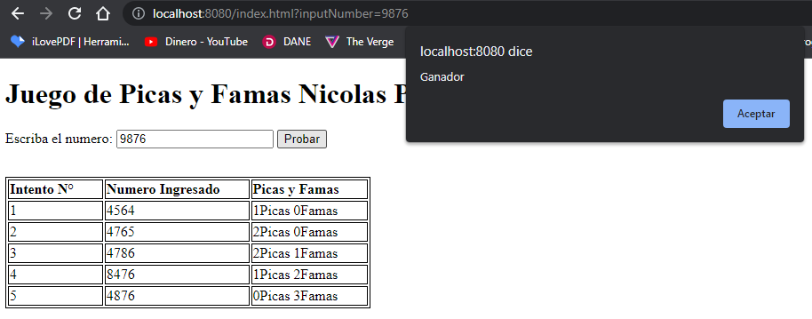
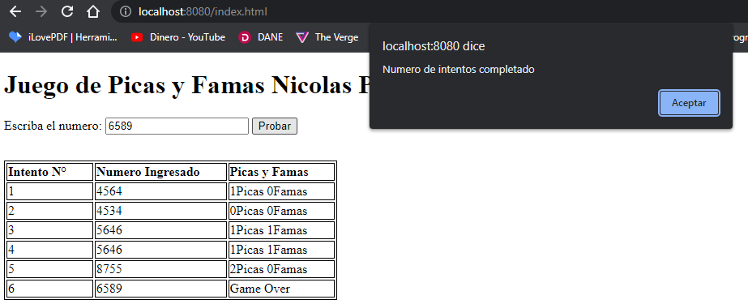

# ARSW Taller 5 2022-i Heroku Spring Picas y Famas

## Autor
### Oscar Nicolas Piñeros Campo

## Descripcion
Picas y Famas es un juego en el que se debe adivinar un numero de 4 dijitos 
para ello se tienen 6 intentos y por cada uno de estos
el juego dira el numero de Picas y Famas por intento y si
hemos adivinado el numero

Las Picas representan que el digito hace parte del numero pero 
no se encuentra el la posicion correcta

Las Famas representan que el digito se encuentra el la posicion correcta
por lo que tener 4 famas es igual a tener el numero correcto

## Fecha

### 21 de Julio de 2022

## Heroku

# Pruebas

(numero predefinido como solucion: 9876)

